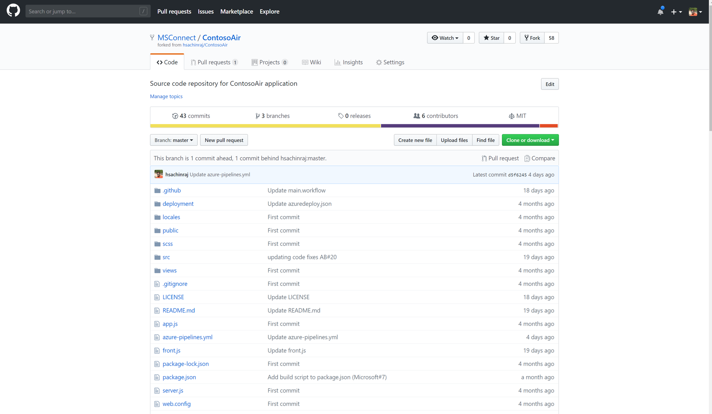
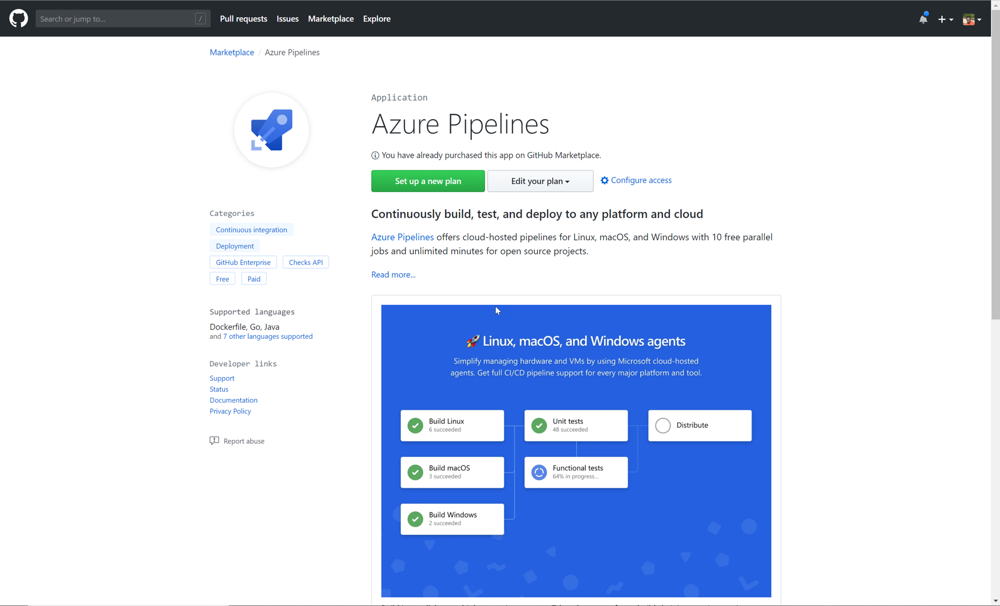
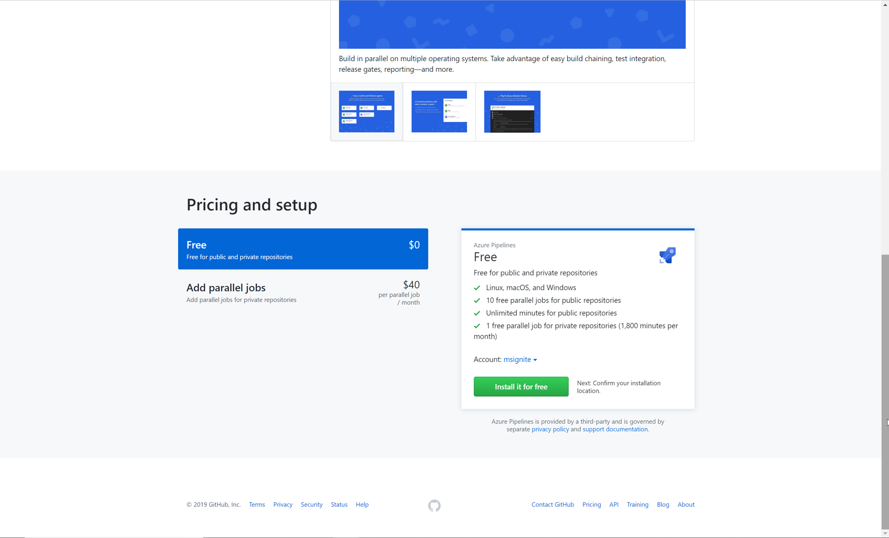
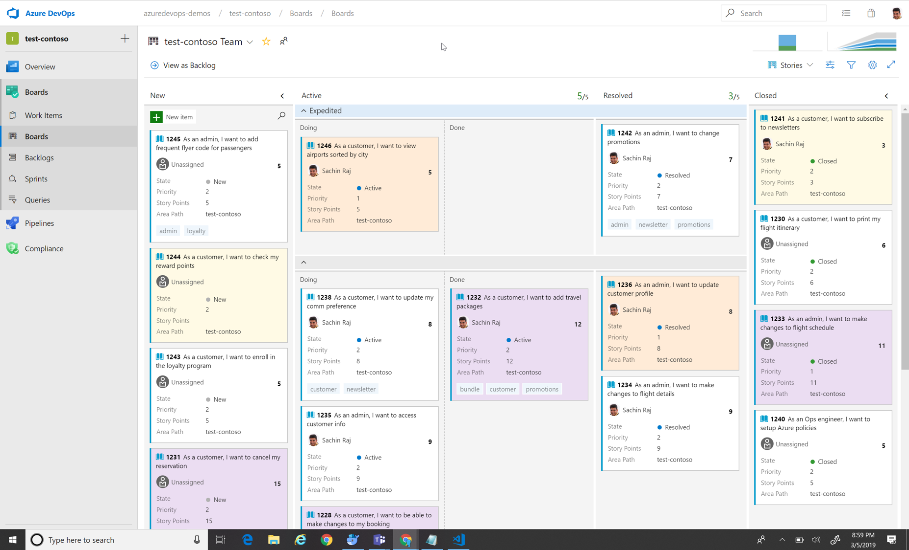
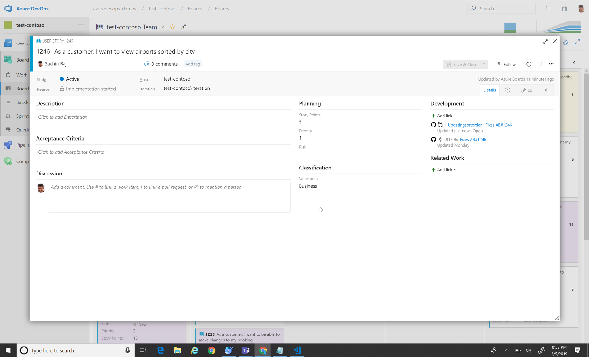
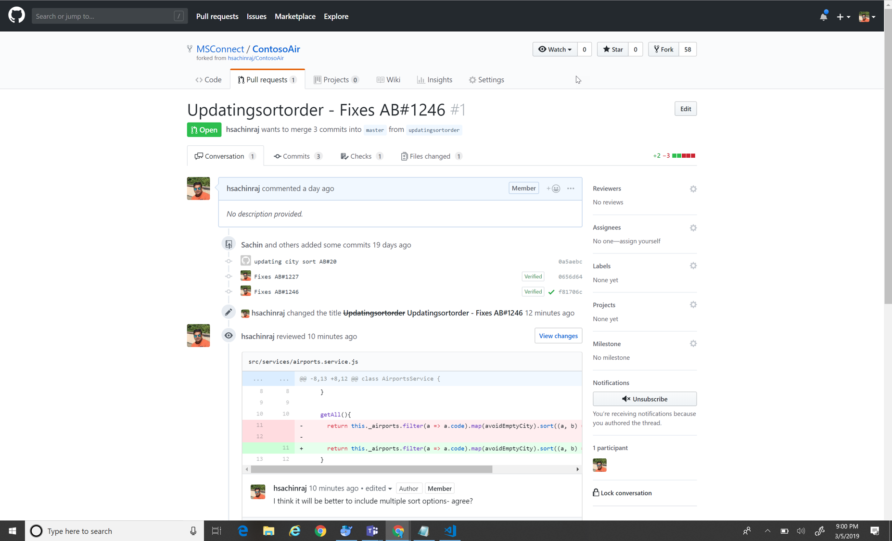
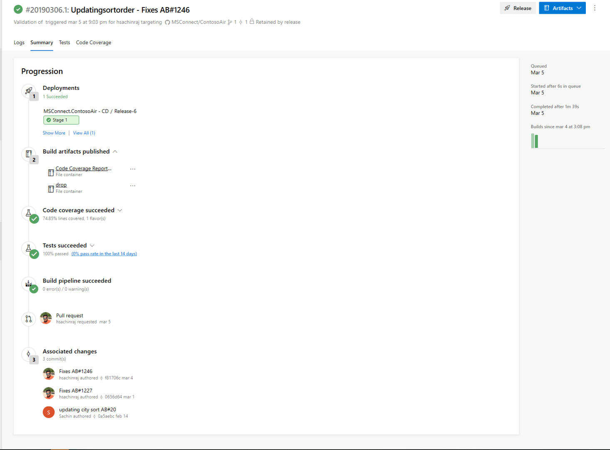

Overview

In this world of digital transformation, not only companies need to innovate to have differentiated values in their offerings, they will need to deliver them both quickly and continuously. That is why organizations are starting to embrace DevOps practices. DevOps automates and speeds software delivery. It makes your process and your products more reliable. When you implement DevOps technologies and practice, you’ll provide value to your customers faster—in the form of new and innovative products, or enhancements to existing ones.

In this demo, we will see how Contoso Air uses GitHub and Azure DevOps to automate software delivery to provide continuous value to users. We will take on the role of helping a fictitious retail company---Contoso Air---that has developed their flagship web site. Contoso relies on their web site to generate and manage business opportunities. However, the current processes they have in place to move a change from their source code to their production systems is time-consuming and open to human error. They use GitHub to manage their source code and want to host their production site on Azure, so it will be our job to automate everything in the middle.

This will involve setting up a pipeline so that commits to the GitHub repo invoke a continuous integration build in Azure DevOps. Once that build is complete, it will invoke a continuous delivery deployment to push the bits out to Azure, creating the required resources, if necessary. The first thing we need to do is to connect GitHub with Azure DevOps, which we can do via the Azure Pipelines extension in the GitHub Marketplace.

Azure Pipelines is available in GitHub Marketplace which makes it  more easy for teams to configure a CI/CD pipeline for any Azure application using your preferred language and framework as part of your GitHub workflow in just a few simple steps.  

Azure Pipelines is free to use for both public and private repos. You get unlimited build minutes and 10 free parallel jobs for public repositories. For private repos, you get 1 free parallel job and 1800 minutes per month. If you have a need to scale your builds, you can add parallel job support for a nominal fee.

Once it is setup and enabled, you assign permissions to which repo can have access to. Now that Azure Pipelines has been installed and configured, we can start building the pipelines but we will need to select a project where the pipeline will be saved. You may select an existing or create a new Azure DevOps project to hold and run the pipelines we need for continuous integration and continuous delivery. The first thing we'll do is to create a CI pipeline.

Every build pipeline is simply a set of tasks. Whether it's copying files, compiling source, or publishing artifacts, the existing library of tasks covers the vast majority of scenarios. You can even create your own if you have specialized needs not already covered. We're going to use YAML, a markup syntax that lends itself well to describing the build pipeline. 

Now that the build pipeline is complete and all tests have passed, we can turn our attention to creating a release pipeline.Like the build templates, there are many packaged options available that cover common deployment scenarios, such as publishing to Azure. 

We also have the option of adding quality gates to the release process. For example, we could require that a specific user or group approve a release before it continues, or that they approve it after it's been deployed. 

Then you define the different environments you want to deploy to and the steps that make up the deployment. Also, just like the build pipeline, the release pipeline is really just a set of tasks. There are many out-of-the-box tasks available, and you can build your own if needed. The first task our release requires is to set up the Azure deployment environment if it doesn't yet exist. Rather than having to manually create the Azure resources required to host the web app, the team has defined an Azure Resource Manager---or ARM---template that describes the environment in JSON. This allows the environment definition to be updated and managed like any other source file. 

Adding Azure Boards to the mix deepens the integration, providing links from the build summary to the related code and work items for end-to-end traceability. By connecting Azure Boards with GitHub repositories, you enable linking between GitHub commits and pull requests to work items. You can use GitHub for software development while using Azure Boards to plan and track your work. Azure Boards provides the scalability to grow as your organization and business needs grow

Azure Boards provides a wealth of project management functionality that spans Kanban boards, backlogs, team dashboards, and custom reporting. When the team members work on a task and make changes to the code, they tie the commits and also the pull requests back to this work item by using the Work Item ID.

This create links between GitHub commits and pull requests to work items tracked in Azure Boards. 

When the pull request is approved and merged, the work item automatically moves into a done stage. 

Azure DevOps and GitHub provides teams a complete overview - they can trace how a user feedback or a user experience turned into a work item, how it was addressed in the code, how the code got built and tested and how the build got deployed to the customer. 

[closing]

